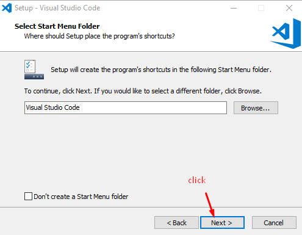
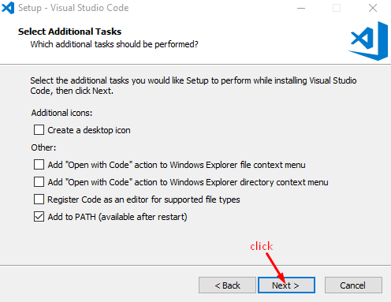
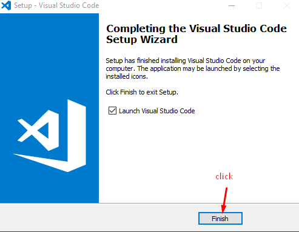
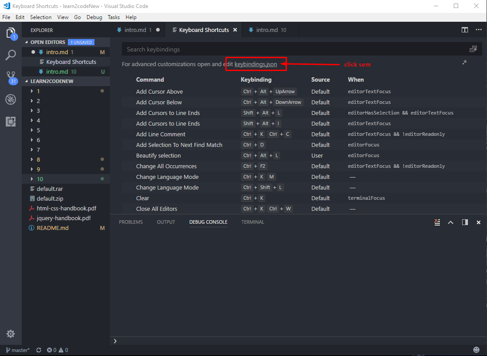
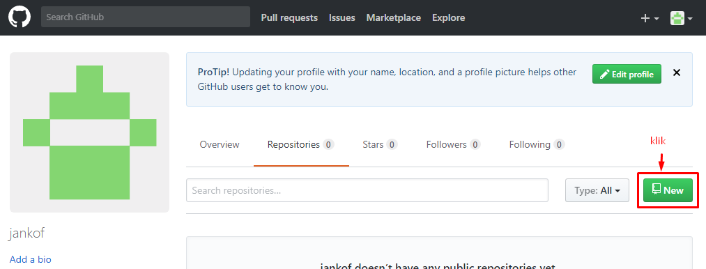
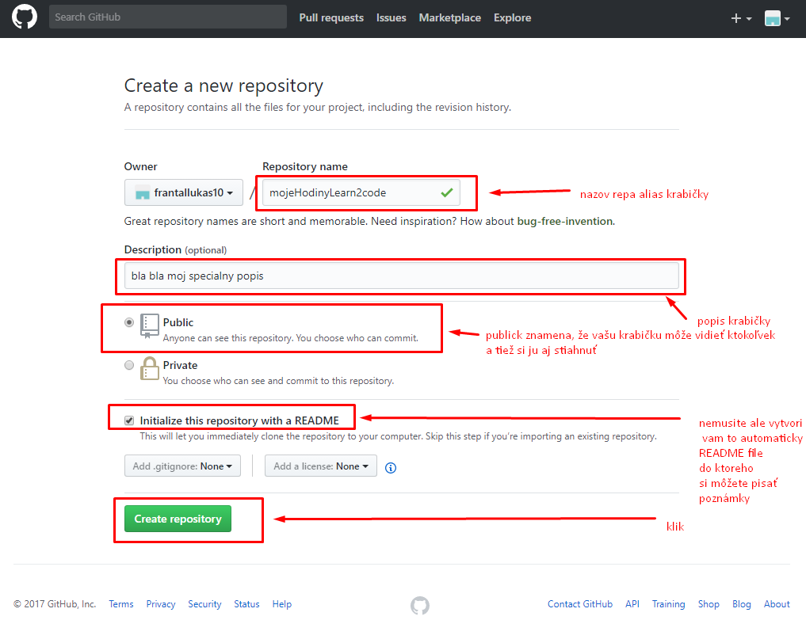

[&#129188; späť](../README.md)</br>

## Modul 1: Editor Visual Studio Code, github a gitkraken

### 1. hodina

#### inštalácia Visual Studio Code</br>
linka kde si stiahnete editor Visual Studio Code <https://code.visualstudio.com/Download></br>

stiahnite si inštaláciu podľa vášho operačného systému, spustite to, možno sa vás spýta do you want to allow this app to make changes to zour device? date yes ak nie nevadí, záleži od vášho operačného systému...</br> 
inštalácia prebieha nasledovne</br> 
</br>
</br>
</br>
</br>
</br>
</br>
</br>
</br>

#### inštalácia doplnkov do editora</br>
otvorte si folder a vlozte do vnútra toto na základe toho aký operačný systém máte

Windows ```%USERPROFILE%\.vscode\extensions```
Mac ```~/.vscode/extensions```
Linux ```~/.vscode/extensions```

takto
</br>

stiahnite a odzipujte tieto doplnky [doplnky](extensions.zip) do otvoreného foldra ktori ste otvorili pomocou url adresy kde sa ukladaju doplnky

takto
</br>

#### nastavenia editora</br>
ako si otvorit nastavenia v editore</br>
</br>

kam si skopirovat nastavenia</br>
</br>
```
  "workbench.startupEditor": "newUntitledFile",
  "atomKeymap.promptV3Features": true,
  "workbench.colorTheme": "Atom One Dark",
  "explorer.confirmDelete": false,
  "git.confirmSync": false,
  "window.zoomLevel": -1,
  "html.format.wrapLineLength": 60,
  "files.autoSave": "onFocusChange",
  "editor.tabSize": 2,
  "editor.matchBrackets": false,
  "highlight-matching-tag.enabled": true,
  "highlight-matching-tag.highlightSelfClosing": true,
  "highlight-matching-tag.leftStyle": {
      "borderWidth": "0",
      "borderStyle": "solid",
      "borderColor": "transparent",
      "borderRadius": "0"
  },
  "highlight-matching-tag.rightStyle": {
      "borderWidth": "0",
      "borderStyle": "solid",
      "borderColor": "transparent",
      "borderRadius": "0"
  },
  "highlight-matching-tag.style": {
      "textDecoration": "underline"
  }
```
#### nastavenia klavesových skratiek v editore</br>
ako si otvorit klavesove nastavenia skratiek v editore</br>
</br>

kliknem na keybindings
</br>

toto skopirujem
```
  {
    "key": "ctrl+alt+l",
    "command": "HookyQR.beautify",
    "when": "editorFocus"
  },
  {
    "key": "ctrl+alt+k",
    "command": "blankLine.process",
    "when": "editorFocus"
  }
```
takto 
</br>

#### Info o skratkách pre editor Visual Studio Code</br>
[info o skratkách](keybindings.md)</br>
pdf s klavesovimy skratkami pre Windows
<https://code.visualstudio.com/shortcuts/keyboard-shortcuts-windows.pdf>
pdf s klavesovimy skratkami pre Mac
<https://code.visualstudio.com/shortcuts/keyboard-shortcuts-macos.pdf>
pdf s klavesovimy skratkami pre Linux
<https://code.visualstudio.com/shortcuts/keyboard-shortcuts-linux.pdf>

nainštalujte si gitBash <https://git-scm.com/downloads/> ktorí pomôže editoru spracovať vaše zmeny v balíčku

#### registracia na github verzionovač vášho kódu a vytvorenie repositara alias krabičky</br>
zaregistrujeme sa do githubu, aby sme mali svoju vlastnu krabičku, kde si budeš odkladať svoju prácu čo si majstroval/a na hodine v priebehu learn2code a tiež aby si sa mohol/a chváliť že si kvely/a a firmy sa o teba mohli pobiť <https://github.com/join></br>
vyplnte udaje a click Create an account, kedže nechcete platiť 7dugatov mesacne a mat sukromne repositare alias krabičky tak si nechajte Unlimited public repositories for free, potom continue, ten step 3 necham na vas...
verifikujte teda potvrdte si účet. Na email vam prišlo info...</br>
Ďalej prejdime na vytvorenie vášho prvého repa alias krabičky, najprv na githube sa preklikneme na váš profil
</br>
vyplníme info o krabičke
</br>
kliknime na konci na tlačidlo create repository aby sme vytvorili našu prvu mega super duper krabičku
</br>
skopirujeme si url adresu našej vytvorenej krabičky, ktorú potrebujeme na skopirovanie do nášho lokálneho prostredia
</br>

#### inštalacia gitKraken</br>
<https://www.gitkraken.com/></br>
po nainštalovaní spustím gitkraken aby sme vedeli preniest naše krabičky z githubu a iného prostredia do našého lokálneho prostredia potrebujeme kliknut na toto
</br>
potom klikneme na clone kde potrebujeme zadefinovať kde chceme našu krabičku v našom počítači
</br>
tu zadefinujeme cez browse tladičlo kde naša krabička bude v našom počítači, potom do url vstupu skopirujeme tu linku z githubu napr. https://github.com/mojnazovaccountu/mojnazobkrabičky
potom kliknem na tlačidlo Clone the repo!
</br>
nejako takto
</br>
potom sa nám v gitkrakene zobrazi hint Successfully cloned repo... klikneme na Open Now
</br>
a už mame našu krabičku v počítači nejako takto by ste mali mať gitkraken
</br>