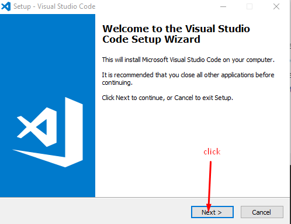
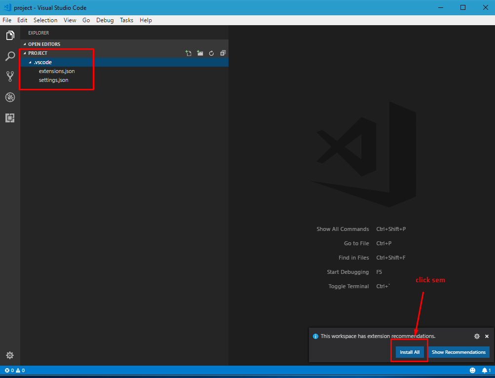
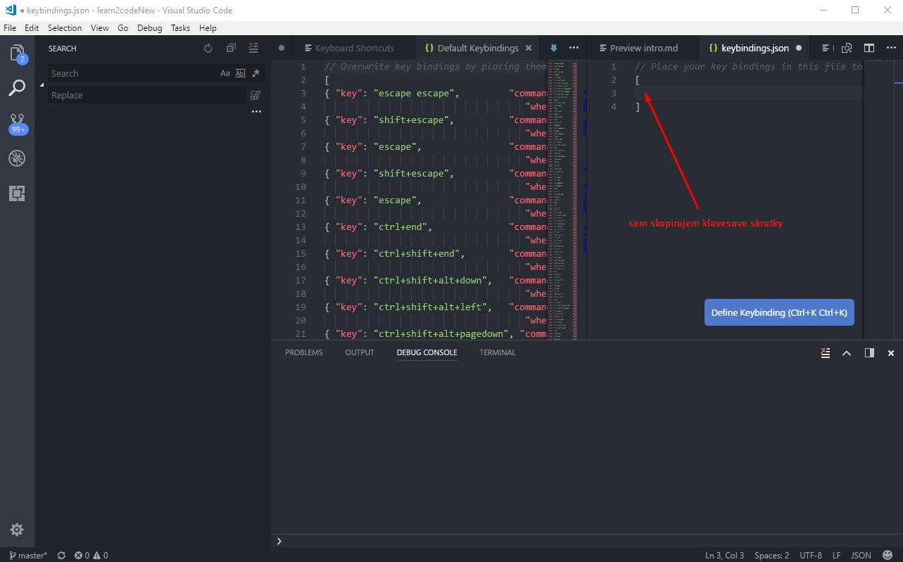
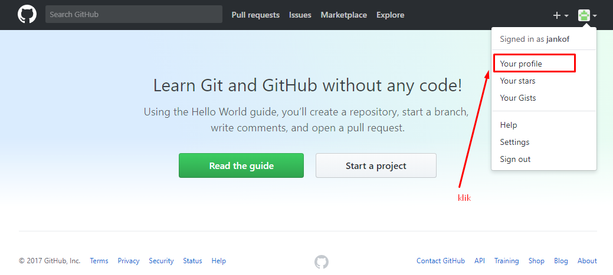

[&#129188; späť](../README.md)</br>

## Modul 1: Nastavenie SublimeText, github a gitkraken

### 1. hodina

#### inštalácia Visual Studio Code</br>
linka kde si stiahnete editor Visual Studio Code <https://code.visualstudio.com/Download></br>

stiahnite si inštaláciu podľa vášho operačného systému, spustite to, možno sa vás spýta do you want to allow this app to make changes to zour device? date yes ak nie nevadí, záleži od vášho operačného systému...</br> 
inštalácia prebieha nasledovne</br> 
</br>
</br>
</br>
</br>
</br>
</br>
</br>
</br>

#### inštalácia doplnkov do editora</br>
otvorte si folder a vlozte do vnútra toto na základe toho aký operačný systém máte

Windows ```%USERPROFILE%\.vscode\extensions```
Mac ```~/.vscode/extensions```
Linux ```~/.vscode/extensions```

takto
</br>

stiahnite a odzipujte tieto doplnky [doplnky](extensions.zip) do otvoreného foldra ktori ste otvorili pomocou url adresy kde sa ukladaju doplnky

takto
</br>


#### inštalacia gitKraken</br>
<https://www.gitkraken.com/></br>

#### registracia github a vytvorenie repositara alias krabičky</br>
zaregistrujeme sa do github, aby sme mali svoju vlastnu krabičku, kde si budeme odkladať každy, svoju prácu na čom majstroval v priebehu learn2code a tiež aby sa mohol chváliť aký je skvelý a firmy sa o neho mohli pobiť <https://github.com/join></br>
vyplnte údaje a klik Create an account, kedže nechcete platiť 7dugatov mesačne a mať sukromne krabičky a repositáre tak si nechajte Unlimited public repositories for free, potom continue, ten step 3 necham na vás...
verifikujte teda potvrdte si účet, na email vam prišlo info
prejde na vytvorenie vášho prvého repa alias krabičky čiže poďme najprv na githube na váš profil
</br>
</br>
kliknime na tlačidlo aby sme vytvorili našu prvu mega super duper krabičku
</br>
vyplníme info o krabičke
</br>
skopirujeme si url adresu našej vytvorenej krabičky, ktorú potrebujeme na skopirovanie do nášho lokálneho prostredia
</br>
otvorme si nainštalovaný gitkraken a poďme si vyklonovať teda skopirovať a nalinkovať náš repo alias krabičku, najprv klinime na ikonku sem
</br>
potom vyberme clone
</br>
vyberme si kde chceme mať krabičku v našom počítači a zadajme našu skopírovanu url adresu krabičky z githubu
</br>
nejako takto
</br>
