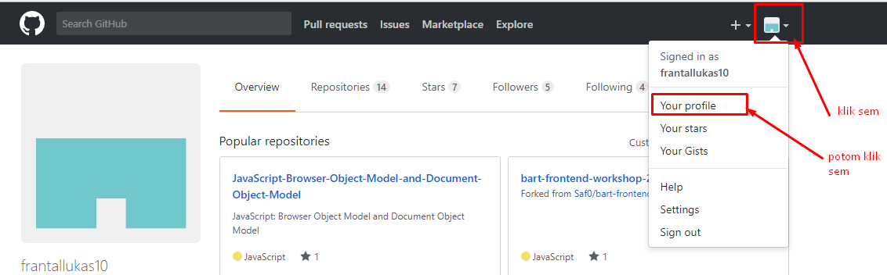
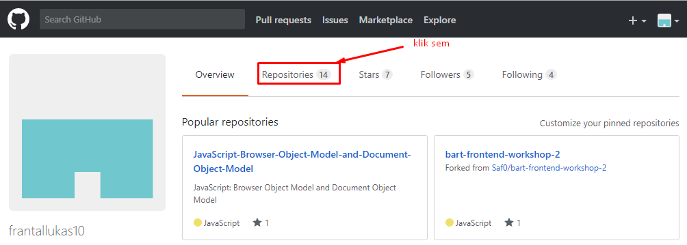
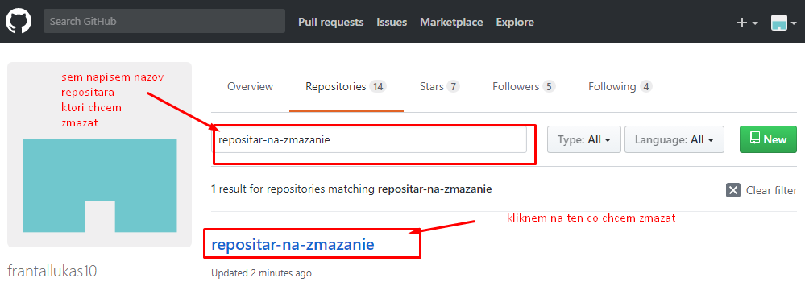
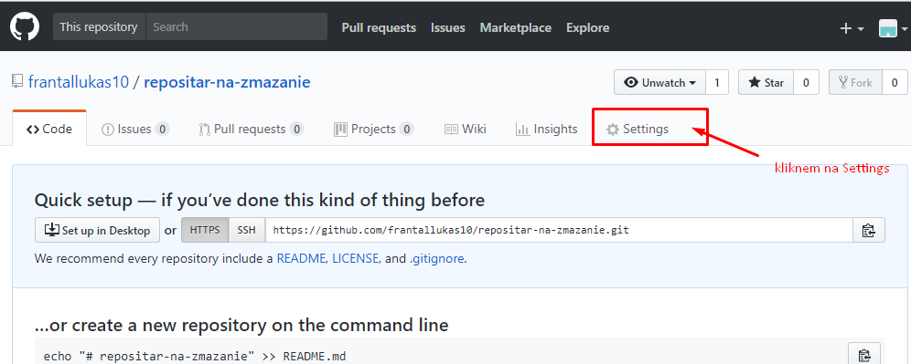
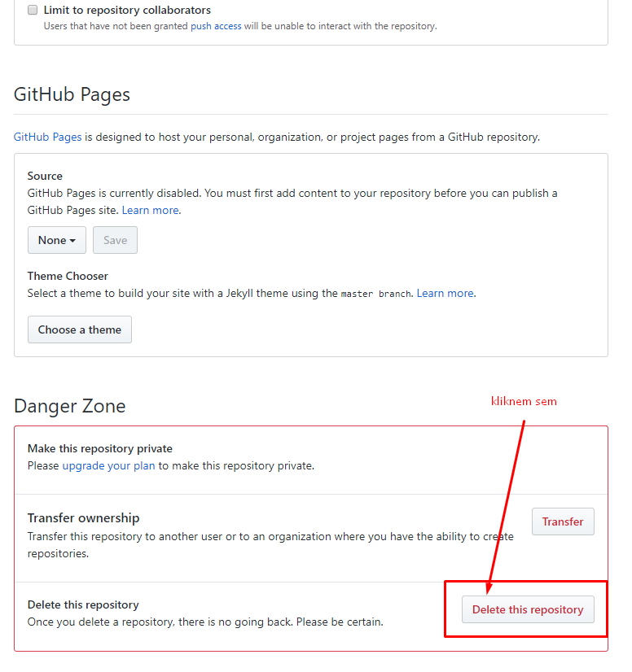
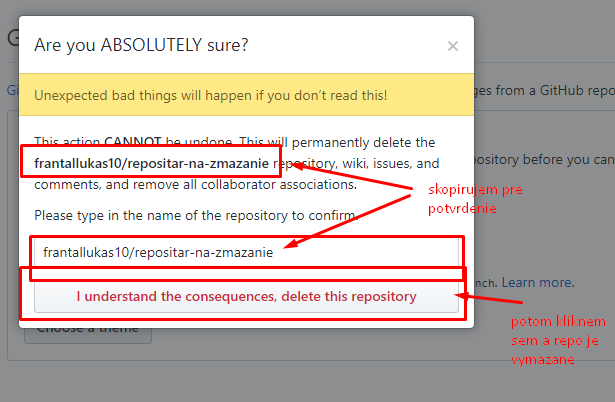
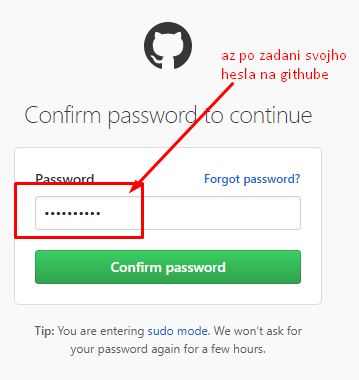

[&#129188; späť](../README.md)

## Modul 3: Opakovanie HTML tagov a mazanie existujuceho repozitara

### 3. hodina
([tretia hodina](lesson)):

#### Manual ako zmazať svoj vytvoreny repozitar 

#### Homework/Domáca úloha 
vytvorte tabulku a použite a html tag teda linky, ktoré sme tiež vytvárali na hodine podľa tohto obrázka
[domaca uloha](homework/homework.png) 

[tu je riešenie, ktoré si pozrite až keď budete mať dokončenú domácu úlohu. Nezabudnite si písať poznámky čo ste nepochopili](homework/solution.html) 
