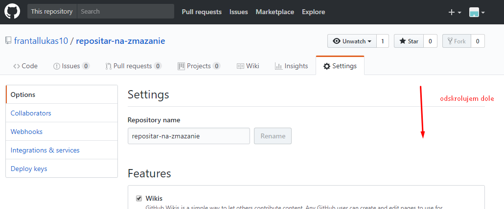

[&#129188; späť](../README.md)

## Modul 3: Opakovanie HTML tagov a mazanie existujuceho repozitara

### <a name="3">3. hodina</a>
([tretia hodina](/druhahodina)):
#### Manual ako zmazať svoj vytvoreny repozitar 

#### Homework/Domáca úloha 
vytvorte tabulku a použite a html tag teda linky, ktoré sme tiež vytvárali na hodine podľa tohto obrázka
[druha domaca uloha](homework.png) 

[riešenie, ktoré si pozrite až keď budete mať hotové a sami si potom svoje projekty popíšete na hodine nech viete kde robíte chyby](homework/solution.html) 
