[&#129188; späť](../../README.md)</br>

## Modul 1: Editor Visual Studio Code, zoznámenie sa s používaním a vytvorenie prvej webovej stránky pomocou základných HTML tágov bez atribútov (blokové a inlinové html tágy bez atributov)

### 1. hodina

#### Homework/Domáca úloha</br>
vytvorte vo vašom folderi, ktorí ste si vytvorili na hodine nový folder s nazvom domaca1 alebo si to pomenujte tak aby ste vedeli ze ide o vasu prvú domácu úlohu a do neho si vytvorte file index.html v ktorom sa pokúste napisať text a obaliť ho html tagmi tak aby ste docielili rovnaky výsledok v prehliadači ako je na tomto obrázku [domaca uloha](homework/homework.png)<br>
nezabudnite používať komentáre k tomu čo ste neporozumeli alebo čo ste nevedeli urobiť...<br>
<hr>

#### blokové a inlinové HTML tágy bez pouzitia atributov, čo je to element</br>
- [info o blokových elementoch, zaberajú celú šírku obrazovky](https://www.w3schools.com/html/html_blocks.asp)</br>
- [info o inlineových elementoch, ktoré zaberajú len toľko koľko potrebujú](https://developer.mozilla.org/en-US/docs/Web/HTML/Block-level_elements)</br>
- [info ako vytvárať commenty](https://www.w3schools.com/html/html_comments.asp)</br>
- [info o pisani html tagoch pre vzhlad stranok1](https://www.w3schools.com/html/html_layout.asp)</br>
- [info o pisani html tagoch pre vzhlad stranok2](https://www.developer.com/lang/understanding-the-proper-way-to-lay-out-a-page-with-html5.html)</br>
- [zakladne info o elementoch](https://www.w3schools.com/html/html_elements.asp)</br>
- [zakladne info o hlavičkových tágoch h1,h2,...,h6](https://www.w3schools.com/html/html_headings.asp)</br>
- [zakladne info o paragraphs html tagoch pre, br, pre](https://www.w3schools.com/html/html_paragraphs.asp)</br>
- [html tagy na formatovanie textu](https://www.w3schools.com/html/html_formatting.asp)</br>
- [citacie pomocou html tagov](https://www.w3schools.com/html/html_paragraphs.asp)</br>
- [zakladne info tabuľkách](https://www.w3schools.com/html/html_tables.asp)</br>
- [zakladne info o zoznamoch](https://www.w3schools.com/html/html_lists.asp)</br>
- [vsetky html tagy po kope](http://overapi.com/html)</br>
<hr>

#### inštalácia Visual Studio Code</br>
linka kde si stiahnete editor Visual Studio Code <https://code.visualstudio.com/Download></br>

stiahnite si inštaláciu podľa vášho operačného systému, spustite to</br> 
inštalácia prebieha nasledovne</br> 
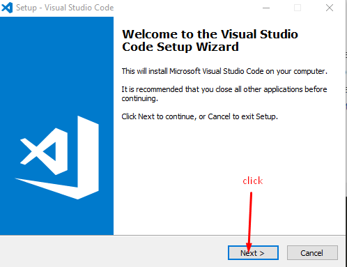</br>
</br>
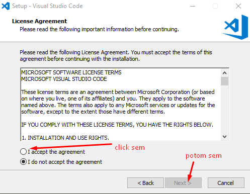</br>
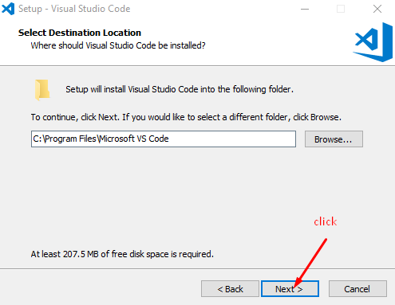</br>
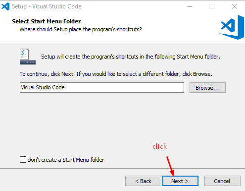</br>
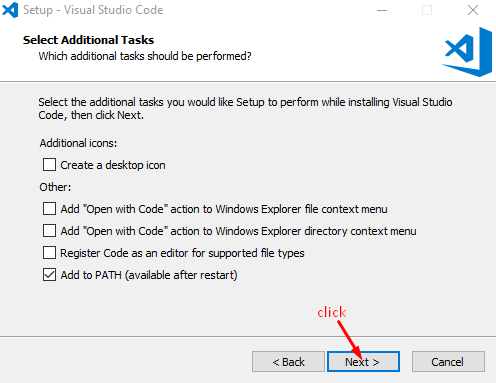</br>
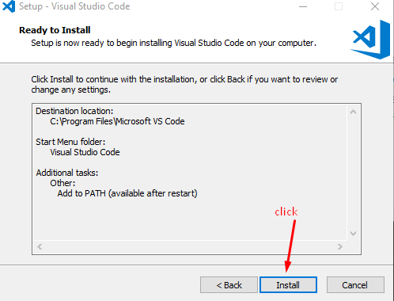</br>
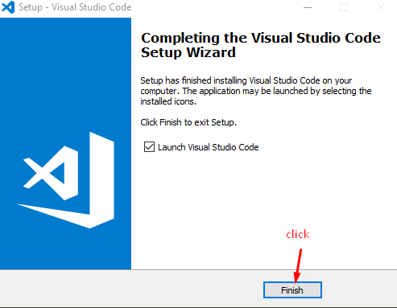</br>
<hr>

#### inštalácia doplnkov do editora</br>
stiahnite si tento [zazipovany folder](vscodeExtensions.zip) alebo [zararovany folder](vscodeExtensions.rar) odzipujte alebo odrarujte ho a otvorte vo Visual Studio Code, potom nasledujte kroky na obrazkoch
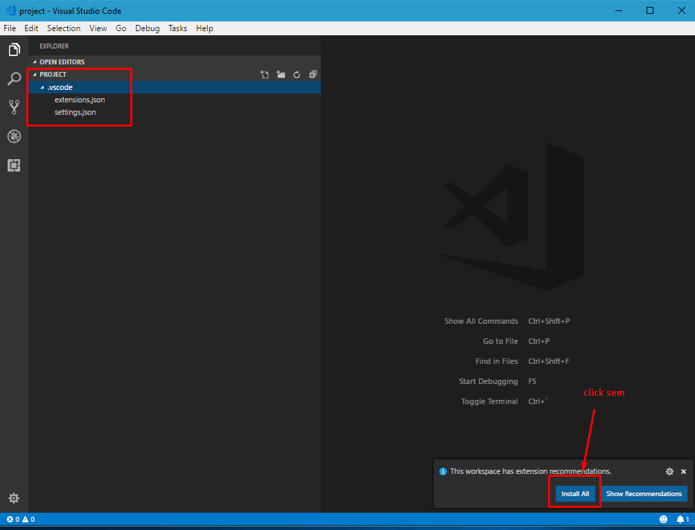</br>
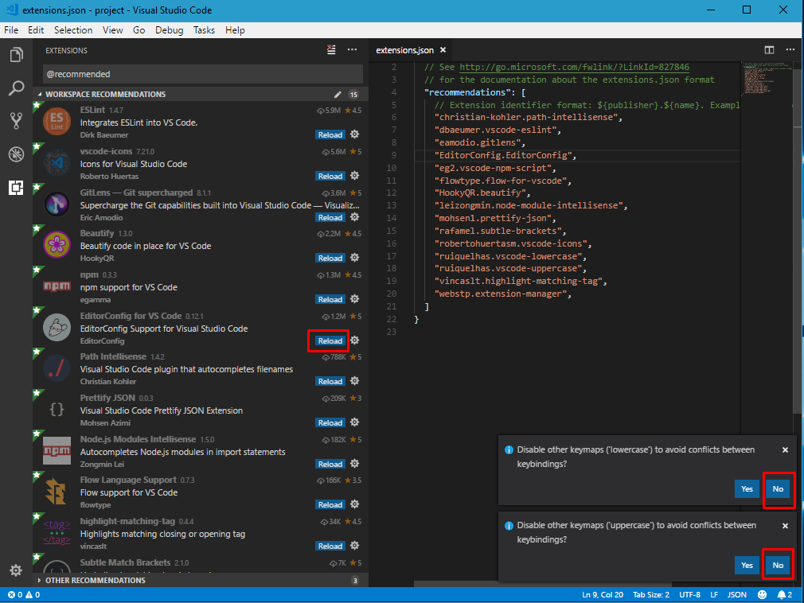</br>
<hr>

#### nastavenia klavesových skratiek v editore</br>
ako si otvorit klavesove nastavenia skratiek v editore</br>
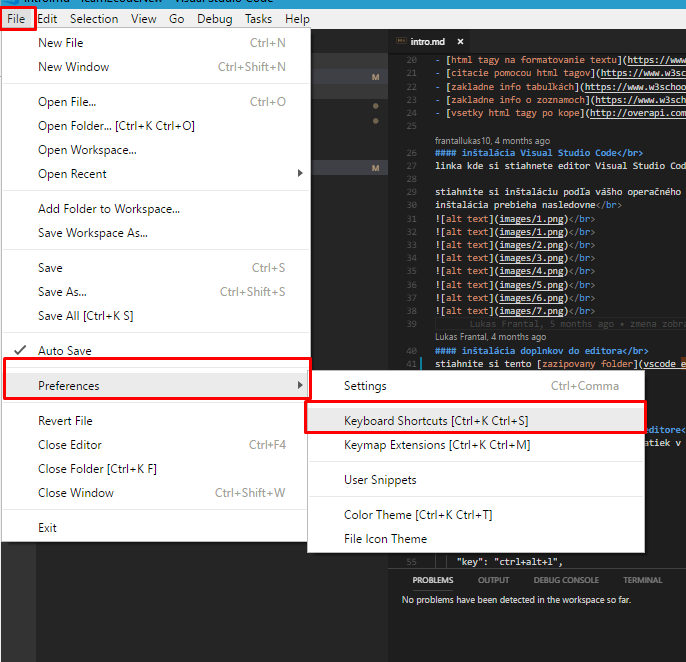</br>

kliknem na keybindings
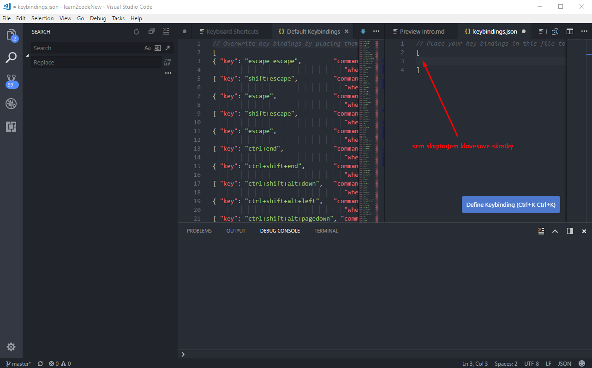</br>

toto skopirujem
```
  {
    "key": "ctrl+alt+l",
    "command": "HookyQR.beautify",
    "when": "editorFocus"
  },
  {
    "key": "ctrl+alt+k",
    "command": "blankLine.process",
    "when": "editorFocus"
  }
```
</br>
takto by to malo vyzerať
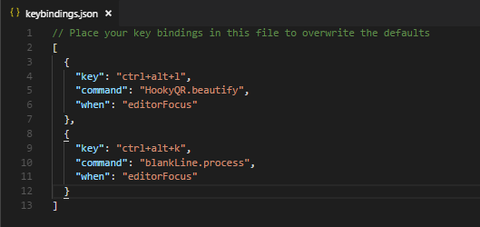</br>
<hr>

#### Info o skratkách pre editor Visual Studio Code</br>
[info o skratkách](keybindings.md)</br>
pdf s klavesovimy skratkami pre Windows
<https://code.visualstudio.com/shortcuts/keyboard-shortcuts-windows.pdf>
pdf s klavesovimy skratkami pre Mac
<https://code.visualstudio.com/shortcuts/keyboard-shortcuts-macos.pdf>
pdf s klavesovimy skratkami pre Linux
<https://code.visualstudio.com/shortcuts/keyboard-shortcuts-linux.pdf>

nainštalujte si gitBash <https://git-scm.com/downloads/> ktorí pomôže editoru spracovať vaše zmeny v balíčku
tiež si môžte stiahnuť nainštalovať node.js aby ste mohli spúšťať npm príkazy v terminály <https://nodejs.org/en/download>
<hr>

#### registracia na github verzionovač vášho kódu a vytvorenie repositara alias krabičky</br>
zaregistrujeme sa do githubu, aby sme mali svoju vlastnu krabičku, kde si budeš odkladať svoju prácu čo si majstroval/a na hodine v priebehu learn2code a tiež aby si sa mohol/a chváliť že si kvely/a a firmy sa o teba mohli pobiť <https://github.com/join></br>
vyplnte udaje a click Create an account, kedže nechcete platiť 7dugatov mesacne a mat sukromne repositare alias krabičky tak si nechajte Unlimited public repositories for free, potom continue, ten step 3 necham na vas...
verifikujte teda potvrdte si účet. Na email vam prišlo info...</br>
Ďalej prejdime na vytvorenie vášho prvého repa alias krabičky, najprv na githube sa preklikneme na váš profil
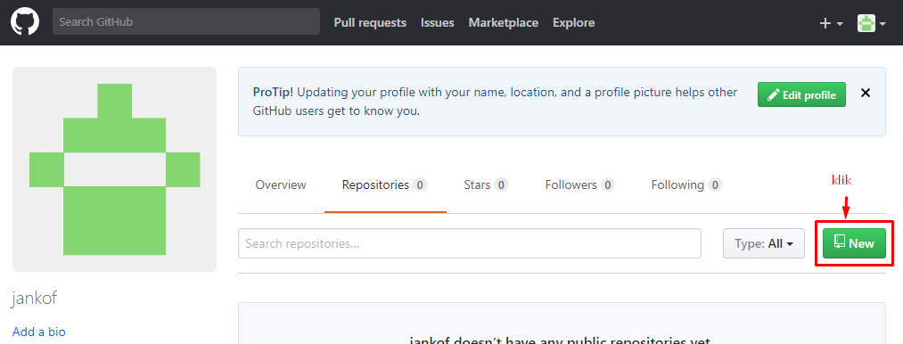</br>
vyplníme info o krabičke
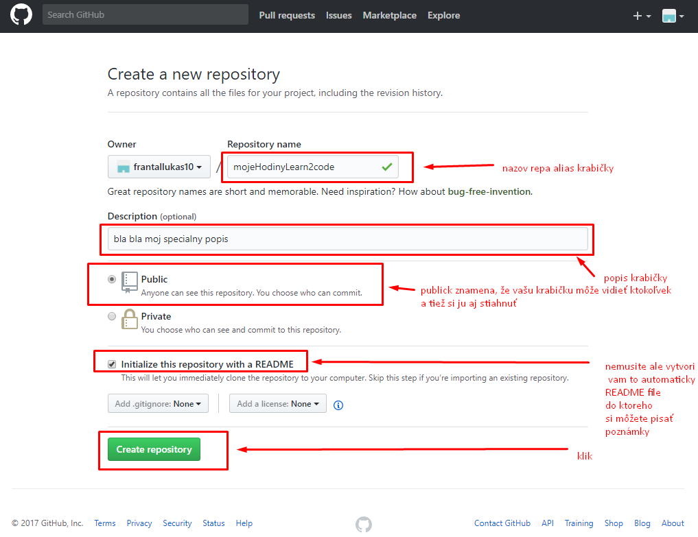</br>
kliknime na konci na tlačidlo create repository aby sme vytvorili našu prvu mega super duper krabičku
</br>
skopirujeme si url adresu našej vytvorenej krabičky, ktorú potrebujeme na skopirovanie do nášho lokálneho prostredia
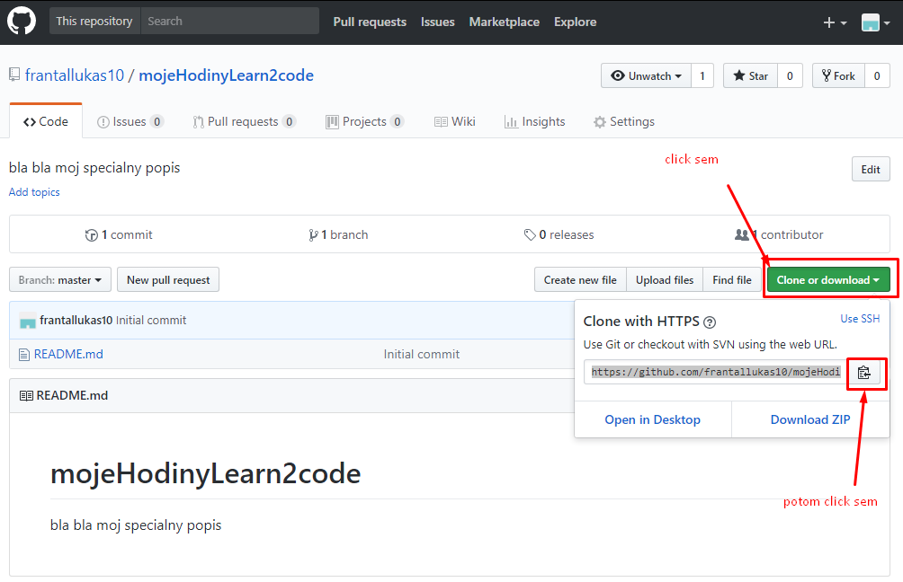</br>

