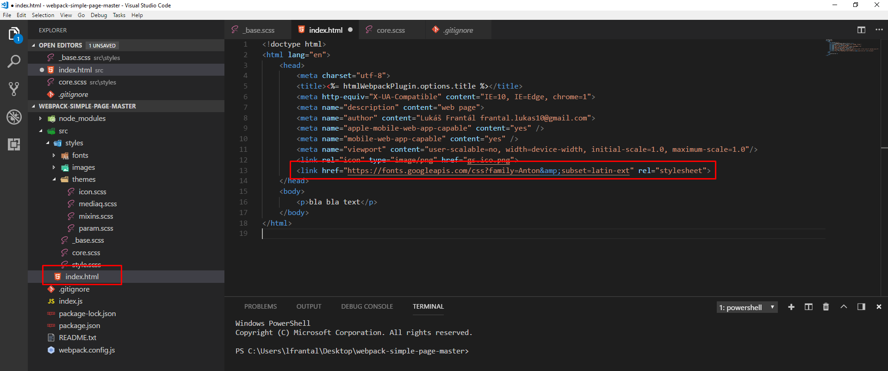

[&#129188; späť](../../README.md) 

## Modul 10: zopakovanie vkladanie ikoniek cez icomoon a vkladanie fontov

### 10. hodina

#### zaujímavé linky
- [stránka cssfontstack](https://www.cssfontstack.com/) 
- [stránka dafont](https://www.dafont.com/) 
- [stránka fonts google](https://fonts.google.com/) 
- [stránka fontsquirrel](https://www.fontsquirrel.com/tools/webfont-generator) 
- [generator na vygenerovanie každého typu file pre fonty a ikonky](https://transfonter.org/) 

#### Typografia fontov a nalinkovanie
`font-family` nam dáva možnosť definovať rodinu fontov, ktoré majú byť zobrazené na stránke, kedže každý operačný systém má svoje vlastné fonty, je nutné si definovať rodinu fontov, kde cez čiarku viete definovať viacero fontov a tak zabezpečiť aspoň nejaký font na stránke. Cez čiarku si viete takto definovať viacero fonto. Ak nebude v PC prvý font použije ten druhý ak nebude ani prvý a ani druhý použije tretí... napr. `font-family: Georgia, Tahoma, Verdana` môžete ísť na túto stránku, kde ľudia definovali príbuzné fonty na základe podobných štýlov, kde aspoň jeden z nich sa bude nachádzať pre každý operačný systém [sem](https://transfonter.org/), takto nemusite sťahovať a linkovať si žiadne stiahnuté fonty, ale len sa spoliehať na to že, používateľ, ktorí príde na vašu stránku bude mať aspoň jeden z definovaných fontov nainštalovaný vo svojom PC. 

Ak by sme chceli rozdeliť fonty, vieme ich rozdeliť na tri časti a to 
- Sans-serif (fonty sa používajú na texty na webe, nemá tie špecialne zobáčiky, ktoré môžeme vidieť pri fonte Times New Roman pri tom Tčku...) 
- Serif (fonty sa používajú pri nadpisoch) 
- Monospaced (fonty majú každé písmenko rovnakej šírky, je to super pri programovaní) 

### Použitie fontov, kde sa spoliehame, že zariadenia majú aspoň jeden font z nášho zoznamu.
 
 
 

### Použitie webfontov a ako si ich nalinkovať do index.html a csska
 
 
 
 
 
 
 
 

### Použitie webfontov a ako si ich nalinkovať do csska ak mame sass builder
 
 
 

### Použitie webfontov bez linky na web ale radšej si ich stiahnem a uložim na svoj server a nalinkujem na stránku
 
 
 
 
 
 
 
 
 

### Tu je info o tom ktorí typ fontu je podporovaný pre ktorí prehliadač [info](https://transfonter.org/formats)
 

