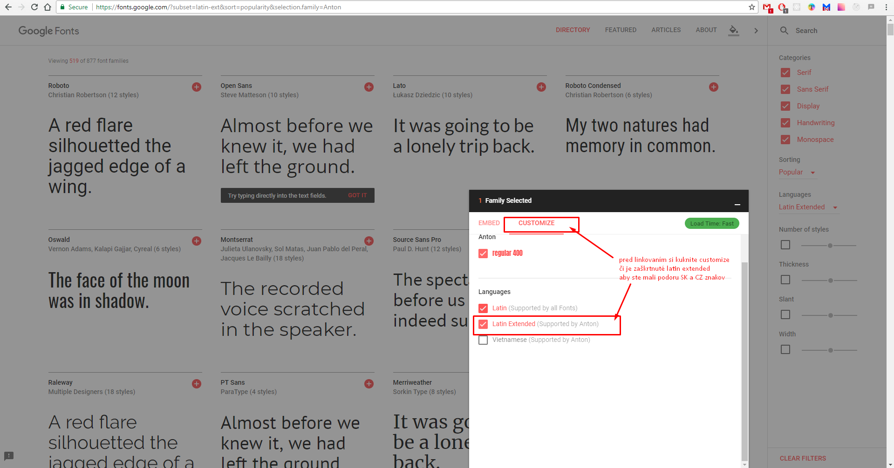
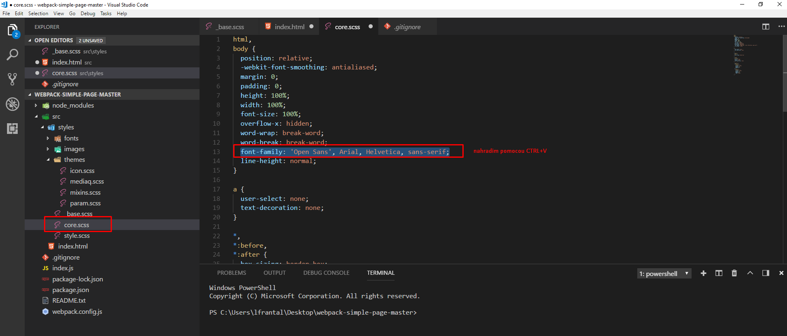

[&#129188; späť](../README.md)</br>

## Modul 10: webpack ako si ho stiahnuť, používať a upraviť...

### 10. hodina

#### zaujímavé linky
- [info o webpacku a jeho možnostiach](https://webpack.js.org/concepts)</br>

#### webpack baliček ako si ho stiahnuť
cez gitKraken si vyclonujete balíček do svojho počítača takto
túto linku si skopírujete a otvoríte gitKraken
```
  https://github.com/frantallukas10/webpack-simple-page.git
```
</br>
po vyklonovani si tento balíček otvoríme vo Visual Studio Code editore cez file, open folder a vyhľadam si kde som si vyklonoval baliček
</br>
</br>
ked to mam otvorené teraz sa naučíme ako webpack balíček spúšťať ale ak ste si ešte nenainštalovali node.js tak si to musíme stiahnuť a nainštalovať, to či ho máte nainštalovaný viete zístiť, tak že do terminálu napíšte node -v a ono by vam malo vypísať v a nejaké číslo vtedy tento krok môžete preskočiť inak tu je linka na stiahnutie node.js <https://nodejs.org/en/download/></br> 
potom si musime otvoriť terminál vo Visual Studio Code cez skratku ctrl+shift+Y mali by sme vidiet toto
</br>
potom sa prekliknem do terminálu v ktorom viem spúšťať príkazy, ktoré som si  zadefinoval v package.json file

pred spustením balíčka si musíme naištalovať balíčky s ktorími pracuje a ktoré mam zadefinované v package.json file, čiže do terminálu napíšem npm install a dám enter
</br>
ak uz máte nainštalované balíčky čiže vidíte folder node_modules a v termináli niečo takéto
</br>
môžete préjsť na spustenie balíčka, ak chcem spustiť balíček treba napísať do terminálu príkaz npm run dev a dať enter
</br>
ak máte správne všetko v balíčku tak na konci by vam malo vybehnuť toto
</br>
ak ho chcete zastaviť stačí stlačiť ctrl+c pre windows os a pre mac os je to Cmd+Return
vyskočí vam hláška či ste si istý napíšte y že myslíte yes a dajte enter
</br>
</br>
tada a sme zastavili baliček
