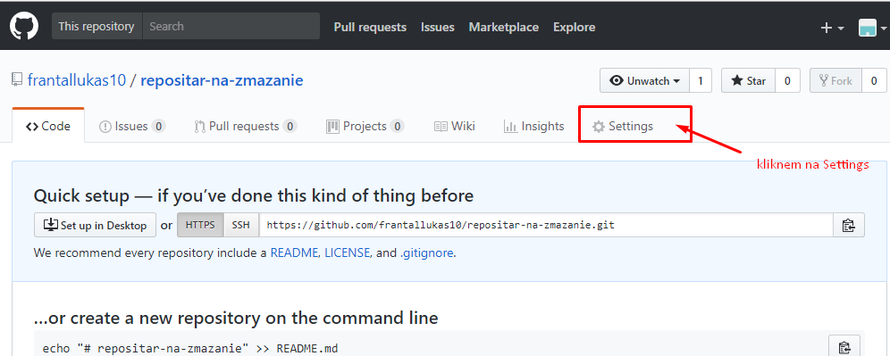

[&#129188; späť](../../README.md) 

## Modul 3: opakovanie HTML tagov, iframe parovy html tag, input, form, select, opiton html tag, vkladanie css stylov: interné, externé, inlinové, atribut class a css seletory, mazanie repozitára 

### 3. hodina
([tretia hodina](lesson)): 

#### info o html tagoch a atributoch: 
[info o iframe html tagu](https://www.w3schools.com/tags/tag_iframe.asp) 
[info o input html tagu](https://www.w3schools.com/html/html_form_attributes.asp) 
[info o select html tagu](https://www.w3schools.com/tags/tag_select.asp) 
[info o form html tagoch](https://www.w3schools.com/html/html_form_elements.asp) 
[info o selektoroch a atribute class](https://www.w3schools.com/cssref/sel_class.asp) 

#### Homework/Domáca úloha 
vytvorte kostru stránky nasledovne použite iframe html tag na vytvorenie youtube videa vo vaše stránke a všetko podľa tohto obrázka
Nezabudnite si písať poznámky čo ste nepochopili alebo nevedeli.
[domaca uloha](homework/homework.png) 

[tu je riešenie, ktoré si pozrite až keď budete mať dokončenú domácu úlohu.](homework/solution.html) 

#### Manual ako zmazať svoj vytvoreny repozitar 

