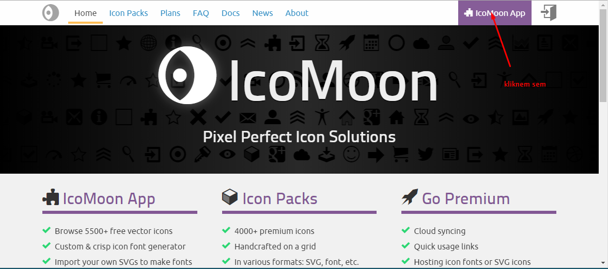

[&#129188; späť](../../README.md) 

## Modul 8: prvé používanie sass, vygenerovanie a vkladanie ikoniek,

### 8. hodina

#### zaujímavé linky o farbách
- [zakladne info o css farbách](https://www.w3schools.com/css/css3_colors.asp) 
- [zakladne info o RGB](https://www.w3schools.com/colors/colors_rgb.asp) 
- [zakladne info o HEX](https://www.w3schools.com/colors/colors_hexadecimal.asp) 
- [farba roku 2017](https://www.pantone.com/color-of-the-year-2017) 
- [color wheel adobe](https://color.adobe.com/create/color-wheel) 
- [nieco o tom farebnom kolese v adobe](https://www.w3schools.com/colors/colors_wheels.asp) 
- [generator farbie na klik](https://color.hailpixel.com) 

#### zaujímavé linky o gradiente
- [zakladne info o gradients](https://www.w3schools.com/css/css3_gradients.asp) 
- [gradients generator](http://www.css3factory.com/linear-gradients) 
- [ďalší gradients generator](http://www.colorzilla.com/gradient-editor/) 

#### ikonky a generátor
- [icomoon generátor ikoniek](https://icomoon.io) 
- [ikonky font awesome](http://fontawesome.io/icons) 
- [ikonky pictos](http://pictos.cc/) 
- [ikonky fontello](http://fontello.com/) 
- [vkladanie ikoniek do HTML](https://dev.w3.org/html5/html-author/charref) 
- [vkladanie ikoniek do HTML a do Javascriptu](https://unicode-table.com/en) 
- [znaky ako text ktore neodporucam vkladat do html](https://www.copypastecharacter.com/symbols) 

#### Postup ako si vygenerovať ikonky a vložiť... 
 

#### Homework/Domáca úloha 
skúste si vygenerovať ikonky a vložiť do stránky podľa návodu
